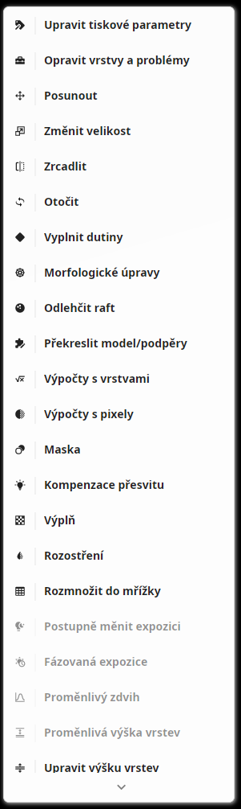
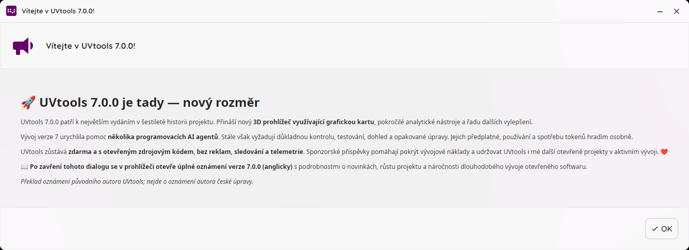

# UVtools CZ — experimental Czech community edition

This is an **unofficial, AI-assisted Czech localization** of [UVtools](https://github.com/sn4k3/UVtools), prepared for the GitHub user **RatmanL**. It is not an official release or an endorsed translation. Original authorship and licensing notices are retained.

Base: upstream `v7.0.0`, commit `4774b6b40838094167998d307aea2a713dcc40dc`.
Modification date: **2026-09-29**. Local revision: **cs-preview.1**.

## What is included

- An editable English-to-Czech dictionary at `translations/cs.json`, installed as `Languages/cs.json`.
- Czech main menus, operation/calibration names, settings, many descriptions and tooltips, print-parameter labels, and the v7.0.0 welcome announcement.
- A presentation-only translation layer in `UVtools.UI/Localization/CzechLocalization.cs`. It leaves editable values, file serialization, numeric culture, and print calculations unchanged.
- A separate `UVtools-CZ` settings directory and window title. The original installation and settings are not replaced.
- Upstream automatic updates disabled for this derivative, with an informational replacement for the built-in update installer, to avoid overwriting the localization. This means the community edition needs separate maintenance.

This is **not a complete localization framework**: Czech is always active. The implementation matches English display strings rather than stable resource IDs. Backend property names, some dynamic/technical messages, the CLI, external websites, and new remote announcements can remain in English. A future upstream contribution should discuss a proper locale selector, stable resources, accessibility keys, and safe fallback behavior with the maintainer first.

The dictionary loader currently requires a valid `Languages/cs.json`. Keep the complete release directory together and back up the dictionary before editing it. If editing breaks JSON syntax, restore the original dictionary.

## Build (Linux x64)

Tested with **.NET SDK 10.0.401** on CachyOS/Arch Linux x64. Other Linux distributions may need additional native dependencies; see the [upstream project](https://github.com/sn4k3/UVtools). No Windows or macOS binaries are offered or claimed tested.

From the repository root:

```sh
sh localization-cs/build-linux.sh
```

The output is `artifacts/publish/UVtools-CZ-linux-x64`. It includes its .NET runtime, license and Czech dictionary. To use a non-system SDK, set `UVTOOLS_DOTNET` to the absolute path of its `dotnet` executable. NuGet restore requires network access. Dependency versions remain those declared by the upstream source; no claim of byte-for-byte reproducible builds is made.

Run after building or extracting a binary archive:

```sh
./start-uvtools-cz.sh
```

Do not replace `/usr/bin/uvtools` or the system package. Linux settings normally live at `~/.local/share/UVtools-CZ`; a valid `XDG_DATA_HOME` is respected by .NET. Ensure an alternate data directory exists before launching if testing with a disposable profile.

## Verification and limits

- Built and started on CachyOS/Arch Linux x64.
- Tools menu and welcome announcement visually checked; the user also confirmed the Calibration menu.
- Regression checks exercise dynamic-menu access-key prefixes, numeric/status values, rendered text updates, and idempotence of all dictionary entries.
- Test SL1 files were converted to GOO and encrypted CTB. Full comparisons with the original English installation showed matching layer properties and print parameters, apart from output directory paths. This is a software regression check, not printer certification.
- No physical print was performed. Do not assume every supported file format/version works on every printer. In particular, the automatically selected `GooV5File` version 51 has not been validated on a physical Elegoo Mars 4. Test models and uncalibrated exposure profiles are deliberately not included in this release.

Run localization regression checks after building:

```sh
dotnet run --project localization-cs/tests/LocalizationTests.csproj
```

The test project uses the DLLs and dictionary from the default publish directory. Override `UVtoolsPublishedDir` with an absolute directory if needed.

## Screenshots





## License and attribution

UVtools is developed by Tiago Conceição / sn4k3 and contributors. This derivative remains under the upstream GNU AGPL license; see the root `LICENSE` and original notices. The modifications are clearly identified here and in the root README. When distributing binaries, provide the matching modified source and build instructions with them, and retain the licenses for bundled dependencies. The source archive accompanying this edition contains the modified source, dictionary, build script and regression checks, not personal settings or private print projects.

AI assistance was used to draft the localization and code changes. Translation quality and less-used UI paths still need community review. Please report the original English text, its UI location, and a proposed Czech correction; remove private filenames or model information from screenshots.

## Česky

Jde o neoficiální českou úpravu, nikoli úplný oficiální překlad. Spusť `start-uvtools-cz.sh` z rozbalené složky. Původní UVtools nepřepisuj. Český slovník je `Languages/cs.json`; před úpravou ho zálohuj a po změně aplikaci restartuj. Některé technické texty a externí dokumentace zůstávají anglicky. Číselné zadávání zachovává původní desetinnou tečku. Aktualizace české kopie se musí připravovat samostatně.
